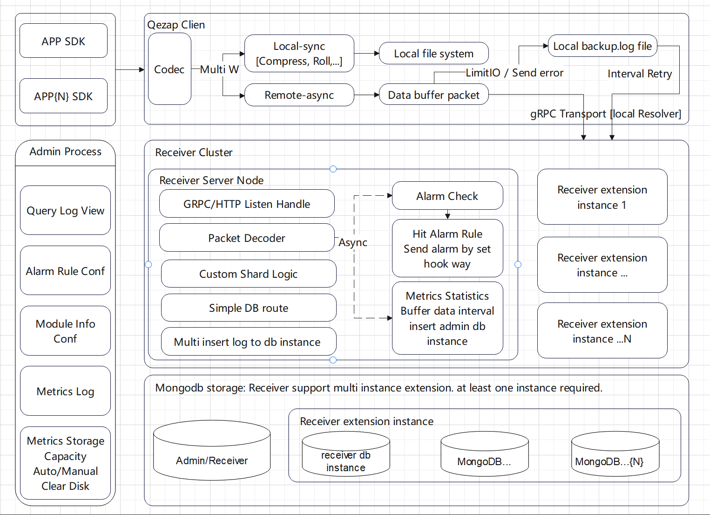
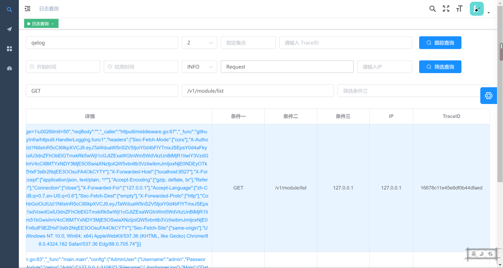
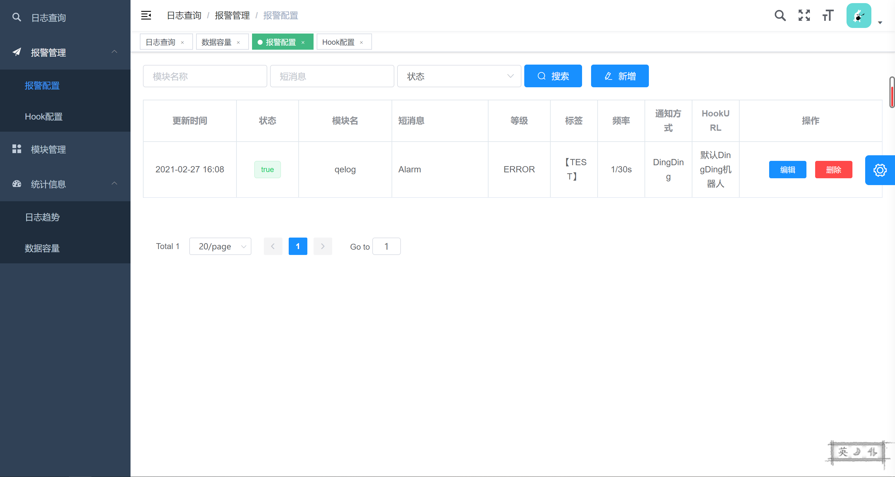
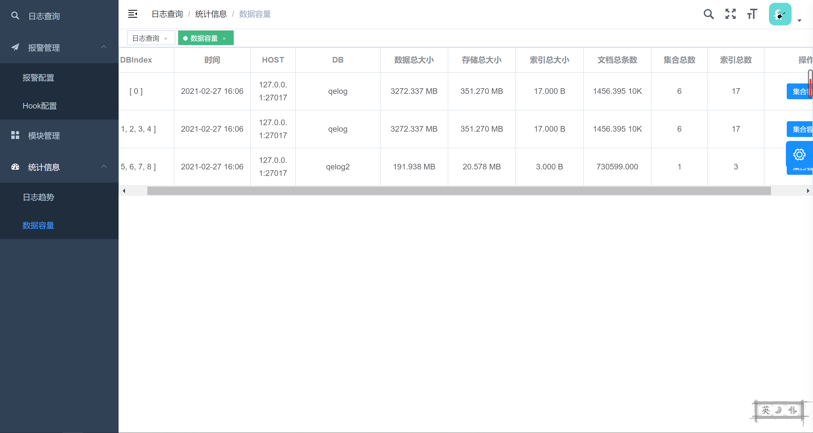

# Qelog

Qelog是一款小巧且功能干练实用的日志系统(集成报警)。采用Push模式，拥有优秀的写入速度、可存储容量高，部署维护成本低等特性。其诞生的目的就是为了解决在中小团队或个人Go项目中，避免为日志系统投入过多的使用运和维成本(ELK)。

采用简单的设计做日志系统最本质的事情。保证系统高效稳定运行的同时兼顾低使用成本及服务运维成本的目标。

### 日志系统拥有的特性:

1. 采用 Uber-zap 的Format，高效格式化日志，友好切换。实现本地与远端的 WriteSyncer与 zapCore。一次格式化，多次写入。
2. WriteSyncer 实现，本地：日志的切割，压缩，保留期，动态切换等级等。远端：数据打包压缩传输，异常备份重试，传输方式支持 HTTP GRPC，网络带宽占用可控，内存占用低等特点。
3. 支持携带额外查询信息，比如 TraceId、查询条件多级筛选。
4. 系统的每个版块都可横向扩展，保证高可用，高性能，高容量。
5. 报警模块，支持日志直接报警，可轻松制定关键词，频率，可实现多种报警方式(目前DingDing)。
6. 存储采用自维护分片分库功能。支持自定义天级别数据分片，项目分库。配置较为简单，支持库容量监控管理。可一直横向扩展，而不影响写入速度。特别优化联合索引查询，保证查询速度，降低索引大小。
7. 支持日志写入统计趋势，可根据等级，主机写入等信息分析出一些有用信息。
8. 方便利用的前端管理平台（单页应用），让查询和配置日志更加高效。
9. 部署简单，依赖少，支持Dokcer快捷部署

### 技术栈及设计简图

#### 技术栈:

1. 后端：语言Golang、协议GRPC、存储Mongodb
2. 前端：Vue

#### 设计简图

### 使用建议

配置文件参考 <a href="https://github.com/huzhongqing/qelog/blob/main/configs/config.toml">configs/config.toml</a>

使用方式可以参考Qelog项目本身

<a href="https://github.com/huzhongqing/qelog/blob/main/infra/logs/qezap.go">infra/logs/qezap.go</a> 

<a href="https://github.com/huzhongqing/qelog/blob/main/infra/httputil/middleware.go">infra/httputil/middleware.log</a>  

<a href="https://github.com/huzhongqing/qelog/blob/main/qezap/example/main.go">qezap/example/main.go</a>

### 后台部分截图

**更多内容，还请部署后查看**

> 后台地址  http://localhost:31080/admin

#### 项目已线上稳定运行接近1年，欢迎大家使用反馈提交RP。感谢支持

